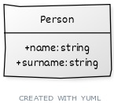

# Person API

This  a simple API allows you to create, read, update, and delete people.

## Setup

### 1. Clone the Repository

```bash
git clone https://github.com/Lilywd/Stage-Two-Task
cd Stage-Two-Task
```

### 2. Create and Activate a Virtual Environment

```bash
# Create a virtual environment
python3 -m venv .venv
```

```bash
# Activate the virtual environment
source .venv/bin/activate # Linux/Mac
.venv\Scripts\activate # Windows
```

### 3. Install Dependencies

```bash
pip install -r requirements.txt
```

### 4. Apply Migrations

```bash
python manage.py makemigrations
python manage.py migrate
```

### 5. Run the Server

```bash
python manage.py runserver
```

The API should now be running locally at 
```bash
http://localhost:8000/api/
```

<!-- 4. Create a .env file and add the following environment variables:

DB_USERNAME=your_username
DB_PASSWORD=your_password
DB_HOST=your_host
DB_PORT=your_port
DB_DATABASE=your_database -->


## Testing
Run:

```bash
python Api/tests.py
```


## UML Diagram



## Documentation

Kindly view the [DOCUMENTATION.md](DOCUMENTATION.md) file for more information on request & respose samples and usages.

## Live URL: [link]()